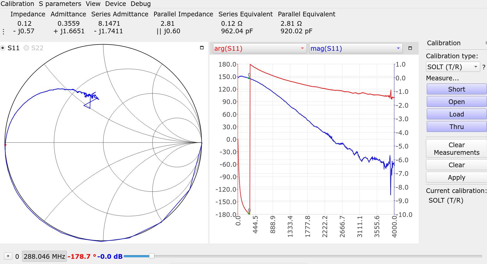

# LAB 1 – Measuring “parasitic” properties of passive components with a VNA

## AUTHOR(S)
Author: Yifan Zhu

Lab Partner: John Kustin

## Abstract
S-Parameters of passive components are measured using a Vector Network Analyzer (VNA), and compared against both ideal circuit models, and more realistic circuit models containing parasitics.
LTSpice is used to obtain frequency responses of circuit models.

## Introduction
Real life passive components are far from ideal.
All capacitors, inductors, and resistors have some parasitic capacitance, inductance, and resistance.
To understand the effect of these parasitics, we use Vector Network Analyzers to measure the s-parameters of passive components, and compare them against what we would expect from ideal componenets.
In addition, we use LTSpice to simulate the effect of parasitics, and compare them qualitatively against observed effects, to see if we have a good understanding of parasitics.

## Measurements and Results

### Inductors
Experiment measurements of the PCB inductor from 50KHz to 100MHz

Experiment measurements of the PCB inductor from 50KHz to 4GHz

Ideally, an inductor has zero resistance and positive reactance at all frequencies; so in the Smith chart it should always stay above the real line, tracing the upper part of the unit sphere.
However, we can see in the plot that it crosses the real axis around 200MHz; 
this is one resonance frequency of the inductor.
In addition, we see that the curve doesn't exactly trace the unit circle;
this hints at some parasitic resistance.

We see that the inductance is around $680nH$.
To get resonance at 200MHz, the parallel capacitance would be about $C=\frac{1}{\omega^2 L}=1pF$.
And we see that series resistance is around $1.6\Omega$.

A more realistic model of an inductor would have some parallel capacitance and series resistance. 
Simulated in LTSpice, the impedance is:

We see a resonance frequency around 190MHz as expected, where magnitude of impedance peaks.
Plotted on a Smith chart, the result of the simulation would be:

We see that this simulation doesn't capture the discrepancy between the curve and the unit circle well, meaning that there are some other parasitics that we are not taking into account.

#### Inductor with legs
Experiment measurements from an inductor with legs from 1MHz to 300MHz:

Ideally, since here we are putting the inductor between port 1 and port 2, we should see the curve trace the upper part of the smaller circle from (0, 0) to (1, 0).
However, here we see that the curve doesn't exactly follow the circle, which implies the existance of parasitics.

### Capacitors
Experiment measurements of the PCB capacitor from 50KHz to 100MHz

Experiment measurements of the PCB capacitor from 50KHz to 4GHz

Ideally, a capacitor has zero resistance and negative reactance at all frequencies; so in the Smith chart it should always stay below the real line, tracing the lower part of the unit sphere.
However, we can see in the plot that it crosses the real axis around 288MHz; 
this is one resonance frequency of the capacitor.

We see that the capacitance is around $100 pF$ .
To get resonance at 288MHz, the series inductance would be about $L=\frac{1}{\omega^2 C}=3nH$.
And we see that series resistance is around $0.1\Omega$.

A more realistic model of a capacitor would have some parallel resistance and series inductance. 
Simulated in LTSpice, the impedance is:

We see a resonance frequency at 288MHz as expected, where magnitude of impedance is at a local minimum.
Plotted on a Smith chart, the result of the simulation would be:

Here, the measurements on the VNA diverge with the LTSpice model, in that LTSpice fails to capture the high resistances that appear at high frequencies.

#### Capacitor with legs
Experiment measurements from capacitor with legs from 1MHz to 300MHz:

Ideally, since here we are putting the capacitor between port 1 and port 2, we should see the curve trace the lower part of the smaller circle from (0, 0) to (1, 0).
However, here we see that the curve doesn't exactly follow the circle, which implies the existance of parasitics.
In addition, we see the curve crosses the real axis at 71MHz, which is a resonance frequency of the capacitor.

## Summary
To conclude, we measured s-parameters of inductors and capacitors using Vector Network Analyzers.
We discovered that these componenets are far from ideal, and their behaviors could be pretty well approximated by taking into account series resistance, parallel capacitance in the case of inductors, and series inductance for capacitors.
However, the discrepencies between the synthesis results and measured results tell us that there are still other parasitics not taken into account; to build these models, we also need more powerful methods to figure out the structure of parasitics and their values.